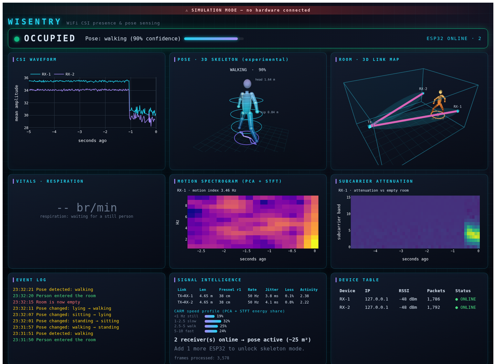

# WiSentry

**WiFi CSI human presence & pose detection.** ESP32 microcontrollers sense
people by measuring how their bodies disturb WiFi radio waves (Channel State
Information). A laptop runs the ML inference and a live dashboard. No cameras,
no radar, no cloud - the runtime is local.



*Live dashboard in simulation mode: a person walking is detected at 90%
confidence — waveform disturbance, stick figure, room-map position, and
event history all update at 5 Hz. More: [empty room](docs/screenshots/dashboard_empty.png) ·
[sitting](docs/screenshots/dashboard_sitting.png) ·
[lying](docs/screenshots/dashboard_lying.png)*

## Detection tiers

| Tier | Capability | Status |
|------|-----------|--------|
| 1 | Presence (occupied / empty) | ✅ working (synthetic-trained; calibrate on real data) |
| 2 | Pose (standing / sitting / lying / walking) | ✅ working (synthetic-trained; calibrate on real data) |
| 3 | 17-point skeleton | 🧪 experimental, demo quality |

## Quick start - simulation, no hardware

```bash
git clone https://github.com/Arjunsk1291/wisentry.git
cd wisentry
pip install -r requirements.txt
python setup_check.py          # all lines must say [ OK ]
python main.py --simulate      # then open http://localhost:8050
```

You get the full live dashboard driven by a physics-based CSI simulator: a
scripted person walks in, stands, sits, lies down, and leaves every 30 s.
This validates the software path only. It is not evidence of real-world sensing
accuracy.

## Real-hardware status

The firmware and setup path are included, but this repository does not yet
publish a reproduced real-room calibration result. Treat the hardware path and
all real-world accuracy as work to validate, not as a completed claim.

## With real hardware

2–4 × ESP32-WROOM-32 boards (~$5 each) + USB power. That's the entire BOM.

1. Flash `firmware/csi_transmitter/` to one board, `firmware/csi_receiver/`
   to the rest — step-by-step: [docs/windows_setup.md](docs/windows_setup.md)
   / [docs/ubuntu_setup.md](docs/ubuntu_setup.md)
2. Place them per [docs/placement_guide.md](docs/placement_guide.md)
3. `python main.py`

## How it works

```text
ESP32 TX ──100 pkt/s──> air (person disturbs multipath) ──> ESP32 RX(s)
ESP32 RX ──UDP wire protocol v1──> laptop
laptop:  udp_server → csi_parser → signal_processor (Hampel, Butterworth,
         band features) → CNN models / rule fallback → debounced detector
         → Dash dashboard (7 panels, 5 Hz)
```

- **Wire protocol v1** is pinned byte-for-byte across firmware, simulator,
  and parser ([engineering specification](docs/ENGINEERING_SPEC.md#52-wire-protocol-v1--single-source-of-truth)) with a shared test vector.
- **Training = runtime**: `models/train_all.py` generates data by pushing
  simulator physics through the same SignalProcessor used live.
- **Honest metrics**: shipped weights are synthetic-trained
  (`saved/metrics.json` is tagged `"data": "synthetic"`); collect your own
  data with `python main.py --collect --label standing` to calibrate.

## Documentation

| Doc | What's in it |
|-----|--------------|
| [docs/user_manual.md](docs/user_manual.md) | 10 chapters, unboxing → live dashboard |
| [docs/hardware_bom.md](docs/hardware_bom.md) | exact parts, prices, where to buy |
| [docs/placement_guide.md](docs/placement_guide.md) | room diagrams, coverage tables |
| [docs/windows_setup.md](docs/windows_setup.md) | Windows + Arduino IDE flashing, every click |
| [docs/ubuntu_setup.md](docs/ubuntu_setup.md) | Ubuntu differences + arduino-cli path |
| [docs/troubleshooting.md](docs/troubleshooting.md) | 30 symptoms with fixes |
| [docs/ENGINEERING_SPEC.md](docs/ENGINEERING_SPEC.md) | full engineering specification |
| [docs/dev/PROJECT_LOG.md](docs/dev/PROJECT_LOG.md) | dated ledger of every test, success, and failure |

## Development

```bash
python -m pytest tests/        # unit tests (parser, DSP, detector, simulator)
python models/train_all.py     # retrain all three models
python scripts/gate_phase3.py --spawn   # end-to-end dashboard gate
```

Project history, including what failed and why, lives in
[docs/dev/PROJECT_LOG.md](docs/dev/PROJECT_LOG.md). CI runs the test suite on Python 3.10 and 3.11.
Model-dependent tests skip when synthetic-trained weights are absent; the status
is reported rather than treated as a verified model result.
