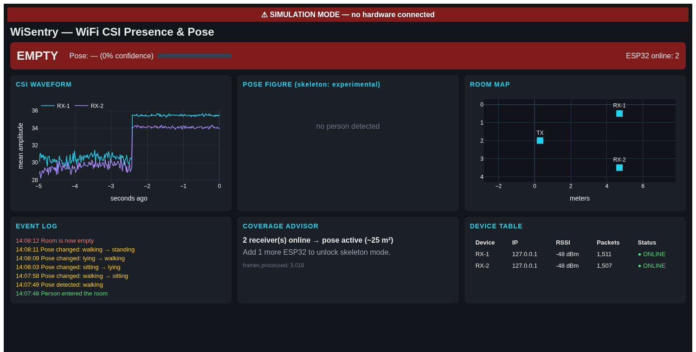
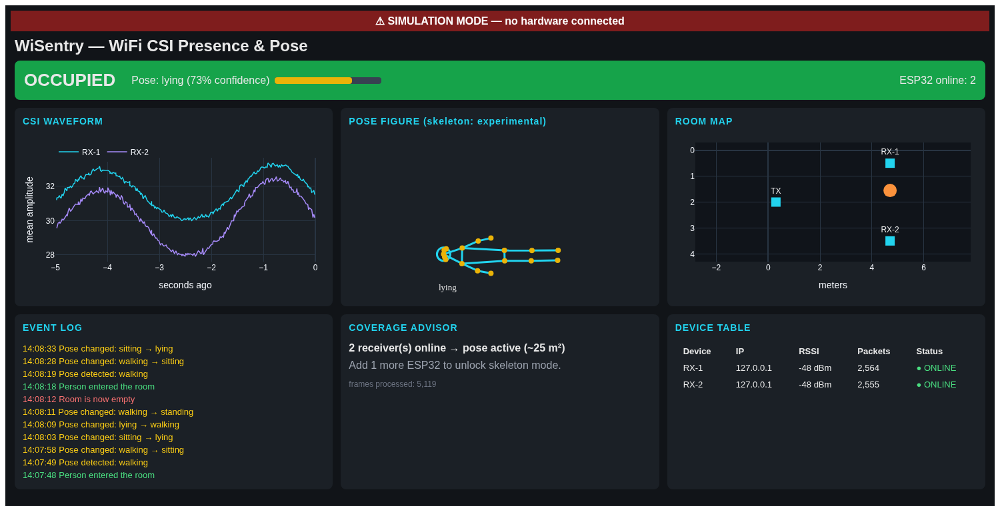

# WiSentry User Manual

From unboxing to a live dashboard, in ten chapters. You do not need any
electronics or programming experience — if you can install a program and
copy-paste commands, you can run WiSentry.

---

## Chapter 1 — What WiSentry is

WiSentry detects people through WiFi. Every WiFi packet that crosses a
room is bent, absorbed, and reflected by whatever is in it — including
human bodies. ESP32 microcontrollers can report exactly how each packet
was distorted (this measurement is called **CSI — Channel State
Information**: 64 numbers per packet, one per radio sub-frequency).
A person standing, sitting, lying, or walking each distorts the radio
field in a recognizably different way. WiSentry's machine-learning
models read those distortions ~100 times per second.

What it gives you, in tiers:

| Tier | Question answered | Needs |
|---|---|---|
| 1. Presence | "Is someone in the room?" | 1 transmitter + 1 receiver |
| 2. Pose | "Standing, sitting, lying, or walking?" | + 1 more receiver |
| 3. Skeleton | 17-point stick figure (**experimental**) | + 1 more receiver |

What it deliberately is NOT: no cameras, no microphones, no cloud — all
processing happens on your laptop, and the radio data never identifies
*who* is in the room.

## Chapter 2 — What's in the box (your shopping list)

See `docs/hardware_bom.md` for the full list with prices and links.
Short version: two to four ESP32 dev boards (~$5 each), data USB cables,
phone chargers, and your laptop. Nothing else.

## Chapter 3 — Install the software (no hardware needed)

Follow Part A of `docs/windows_setup.md` (or `docs/ubuntu_setup.md`).
End state: `python setup_check.py` prints all `[ OK ]`.

## Chapter 4 — Your first run: simulation mode

```bat
python main.py --simulate
```

Open **http://localhost:8050**. You'll see a red *SIMULATION MODE*
banner and a scripted 30-second loop: empty room → a simulated person
walks in → stands → sits → lies down → walks out. Watch each panel react:

- **Status bar** flips EMPTY (red) → OCCUPIED (green) about 6 s in.
- **CSI waveform** goes from flat-ish lines to visible disturbance.
- **Pose figure** draws a stick figure that changes shape.
- **Event log** collects green "entered" / yellow "pose" / red "left"
  lines.

Everything you see later with real hardware behaves the same way — this
mode exists so you can learn the dashboard before touching an ESP32, and
so you can verify the software end-to-end on its own.

Stop with `Ctrl+C` in the terminal.

## Chapter 5 — The dashboard, panel by panel

What you should be seeing (simulation mode):

| Empty room | Person lying down |
|---|---|
|  |  |

Note in the right-hand shot how the CSI waveform shows a slow sine wave —
that is the simulated person's **breathing** modulating the radio field,
and it's exactly what keeps presence latched while someone lies still.

1. **STATUS BAR** — the headline: OCCUPIED/EMPTY, current pose with a
   confidence bar, and how many ESP32 receivers are online.
2. **CSI WAVEFORM** — the last 5 seconds of raw signal level, one line
   per receiver. Your best debugging tool: a healthy idle room is a
   gently wobbling line; a person moving makes it dance; a dead flat
   line at zero means no data is arriving.
3. **POSE FIGURE** — stick figure for the detected pose. The yellow
   joint dots come from the experimental skeleton model — treat them as
   a tech demo, not measurement.
4. **ROOM MAP** — top-down view of your room with your configured device
   positions (cyan squares) and the estimated person position (orange
   dot). Edit your real room size and device spots in `config.yaml`
   under `room:`.
5. **EVENT LOG** — timestamped history: green = entered, red = left,
   yellow = pose change.
6. **COVERAGE ADVISOR** — tells you what your current number of online
   receivers unlocks and what one more would add.
7. **DEVICE TABLE** — per-receiver health: IP, signal strength (RSSI),
   packet count, ONLINE/OFFLINE.

## Chapter 6 — Flash the ESP32s

Follow Part B of your OS setup guide, step by step. You'll flash:

- **one transmitter** — creates the `WiSentry` WiFi network and floods
  it with 100 measurement packets per second;
- **one receiver per board you have left** — each joins that network,
  measures CSI, and streams it to your laptop (set `DEVICE_ID` to 1, 2,
  3… before each flash).

*Advanced alternative (skip on first build):* instead of the dedicated
WiSentry network you can put everything on your home WiFi — flash the
receivers with your home SSID/password and set `LAPTOP_ADDRESS` to your
laptop's IP. The dedicated-AP default is recommended because it
guarantees a single channel and zero router weirdness.

## Chapter 7 — Place the devices and go live

1. Place boards per `docs/placement_guide.md` (TX one side, RXs the
   other, chest height).
2. Power TX and RXs from chargers.
3. Connect the laptop to the `WiSentry` WiFi network.
4. With the room otherwise **empty**, run:
   ```bat
   python main.py
   ```
5. Stay out (or stand still by the door) for ~10 seconds — WiSentry
   learns the empty-room radio baseline at startup.
6. Open http://localhost:8050 — no red banner, receivers ONLINE in the
   Device Table. Walk in. Watch the status flip.

## Chapter 8 — Reading the results honestly

The models shipped with the repo were trained on **synthetic data**.
They prove the pipeline works and demo nicely, but in *your* room with
*your* furniture:

- **Presence** is usually decent out of the box (it keys on strong,
  general signal disturbance).
- **Pose** will be unreliable until you retrain on real data
  (Chapter 9). The dashboard's confidence bar tells you how sure the
  model is — low, jumpy confidence means "don't trust this yet".
- **Skeleton** is a research demo at this hardware tier, full stop.

Numbers in `saved/metrics.json` are tagged `"data": "synthetic"` for
exactly this reason.

## Chapter 9 — Collecting real data and retraining

This is how you reach the real accuracy targets (presence >95%, pose
>80%). Budget ~30 minutes of acting:

1. For each label, run a collection session while a person does only
   that activity in the sensing zone:
   ```bat
   python main.py --collect --label empty    --duration 120
   python main.py --collect --label standing --duration 120
   python main.py --collect --label sitting  --duration 120
   python main.py --collect --label lying    --duration 120
   python main.py --collect --label walking  --duration 120
   ```
   (`empty` = nobody in the room.) Start each run with the room empty for
   ~5 s (the empty-room baseline), then walk in and hold the pose. Each run
   saves labeled windows into `logs/dataset/`.
2. Check the capture: `python scripts/check_capture.py` (PASS/FAIL per
   receiver and per label). Then retrain on your data:
   `python models/train_real.py --eval-only` shows how the synthetic models
   do on your room; `python models/train_real.py` fine-tunes them and writes
   `saved/real/`. Set `ml.model_dir: saved/real` in config.yaml to use them.
3. Restart `python main.py`. The detector now uses models tuned to your
   actual room.

Re-collect whenever you rearrange furniture or move the boards.

## Chapter 10 — Living with WiSentry

- **Startup routine:** power the boards, connect to WiSentry WiFi,
  `python main.py`, keep the room empty for the first 10 seconds.
- **Shutdown:** `Ctrl+C`. Boards can stay powered forever.
- **Logs:** every session writes `logs/events_*.csv` — a timestamped
  record of every enter/leave/pose event, ready for a spreadsheet.
- **Tuning knobs** (`config.yaml`): detection thresholds, debounce
  counts, room geometry, ports. Every key is commented in the file.
- **Health checks:** Device Table for ONLINE status and RSSI; the
  waveform panel for live signal; `python setup_check.py` after any
  software change.
- **When something breaks:** `docs/troubleshooting.md` — 30 symptoms
  with fixes.

Privacy note, since people will ask you: WiSentry senses *that* a body
disturbs the radio field, with no imagery and no identity. Still, it is
presence sensing — tell the people who live with you that it's running.
